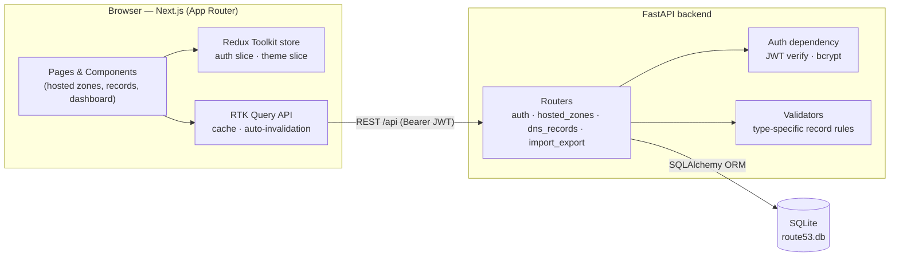
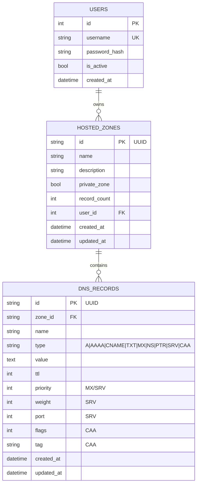

# AWS Route 53 Clone

A functional clone of the AWS Route 53 console: hosted zone and DNS record management with a Next.js frontend, FastAPI backend, and SQLite persistence. Mocked authentication; mocked AWS dependencies (IAM, Organizations, Billing, etc.).

## Tech Stack

- **Frontend**: Next.js (App Router) + TypeScript + Tailwind CSS
- **State management**: Redux Toolkit + RTK Query
- **Backend**: FastAPI + SQLAlchemy
- **Database**: SQLite

## Setup

### Backend

```bash
cd backend
python -m venv venv
venv\Scripts\activate        # Windows
# source venv/bin/activate   # macOS/Linux
pip install -r requirements.txt
python seed.py                # creates route53.db with a default user + sample zone
uvicorn app.main:app --reload --port 8000
```

The API runs at `http://localhost:8000` (Swagger docs at `/docs`).

Optional environment variable:

| Variable     | Default                               | Purpose                          |
| ------------ | -------------------------------------- | --------------------------------- |
| `SECRET_KEY` | dev fallback in `app/dependencies.py` | Secret used to sign JWT tokens. Set this in any real deployment. |

Default seeded credentials: **admin / admin**.

### Frontend

```bash
cd frontend
npm install
npm run dev
```

The app runs at `http://localhost:3000` and expects the backend at `http://localhost:8000/api` (see `frontend/src/store/api.ts`).

## Architecture Overview

### System diagram



### Folder layout

```
frontend/        Next.js app (App Router, client components)
  src/app/         routes: /login, /, /hosted-zones, /hosted-zones/[id],
                    /hosted-zones/create, /hosted-zones/[id]/records/create,
                    /hosted-zones/[id]/records/[recordId]/edit,
                    /traffic-policies, /health-checks, /resolver, /profiles
  src/store/       Redux store, slices (auth, theme), RTK Query API, typed hooks
  src/components/  TopNav, Sidebar, Modal, RecordForm, ComingSoon
  src/lib/         auth + theme wrappers (Redux-backed), toast context, shortcuts
  src/types/       shared TS types (HostedZone, DNSRecord, RecordType)

backend/         FastAPI app
  app/main.py       app + CORS + router wiring
  app/database.py   SQLAlchemy engine/session (SQLite)
  app/models.py     ORM models: User, HostedZone, DNSRecord
  app/schemas.py    Pydantic request/response models
  app/dependencies.py  password hashing, JWT issuing/verification
  app/validators.py    type-specific DNS record validation
  app/bind.py          BIND zone-file export/parse
  app/routers/      auth, hosted_zones, dns_records, import_export endpoints
```

The frontend talks to the backend exclusively over REST under `/api`. **State lives in a Redux Toolkit store**: `auth` and `theme` slices hold global UI state, while **RTK Query** owns all server data (hosted zones, records) with automatic caching and tag-based invalidation — a create/update/delete refreshes the affected lists without manual refetching.

Auth is JWT-based: `POST /api/auth/login` returns a bearer token, which the frontend stores in `localStorage` and the RTK Query base query attaches as `Authorization: Bearer <token>` on every request. On load, the app calls `GET /api/auth/me` with the stored token to restore the session; an invalid/expired (401) response clears the token and redirects to `/login`. All Hosted Zone and DNS Record data is scoped to the authenticated user and persisted in SQLite (`backend/route53.db`).

## Database Schema

### Entity-relationship diagram



A user has many hosted zones; a hosted zone has many DNS records. Deleting a zone cascades to its records.

### Column reference

**users**
| Column         | Type      | Notes                  |
| -------------- | --------- | ----------------------- |
| id             | Integer   | PK, autoincrement       |
| username       | String    | unique                  |
| password_hash  | String    | bcrypt hash             |
| is_active      | Boolean   | default true            |
| created_at     | DateTime  |                          |

**hosted_zones**
| Column         | Type      | Notes                              |
| -------------- | --------- | ------------------------------------ |
| id             | String(36)| PK, UUID                            |
| name           | String    | domain name, e.g. `example.com.`    |
| description    | String    | optional                            |
| private_zone   | Boolean   | public vs private                  |
| record_count   | Integer   | denormalized count of child records |
| created_at     | DateTime  |                                      |
| updated_at     | DateTime  |                                      |
| user_id        | Integer   | FK → users.id                       |

**dns_records**
| Column     | Type       | Notes                                            |
| ---------- | ---------- | -------------------------------------------------- |
| id         | String(36) | PK, UUID                                          |
| zone_id    | String(36) | FK → hosted_zones.id (cascade delete)            |
| name       | String     | record name, e.g. `www` or `@`                   |
| type       | String     | one of A, AAAA, CNAME, TXT, MX, NS, PTR, SRV, CAA |
| value      | Text       |                                                    |
| ttl        | Integer    | default 300                                       |
| priority   | Integer    | MX / SRV                                          |
| weight     | Integer    | SRV                                                |
| port       | Integer    | SRV                                                |
| flags      | Integer    | CAA                                                |
| tag        | String     | CAA (`issue` / `issuewild` / `iodef`)             |
| created_at | DateTime   |                                                    |
| updated_at | DateTime   |                                                    |

## API Overview

All endpoints except `/api/health`, `/api/auth/login`, and `/api/auth/register` require `Authorization: Bearer <token>`.

**Auth** (`/api/auth`)
| Method | Path        | Description                  |
| ------ | ----------- | ----------------------------- |
| POST   | `/login`    | Authenticate, returns user + token |
| POST   | `/logout`   | Stateless logout acknowledgement |
| GET    | `/me`       | Current authenticated user    |
| POST   | `/register` | Create a new user             |

**Hosted Zones** (`/api/hosted-zones`)
| Method | Path           | Description                                   |
| ------ | -------------- | ----------------------------------------------- |
| GET    | `/`            | List zones (paginated, `search`, `page`, `page_size`) |
| POST   | `/`            | Create a zone                                  |
| GET    | `/{zone_id}`   | Get a single zone                              |
| PUT    | `/{zone_id}`   | Update a zone                                  |
| DELETE | `/{zone_id}`   | Delete a zone (cascades to its records)        |

**DNS Records** (`/api/hosted-zones/{zone_id}/records`)
| Method | Path             | Description                                                   |
| ------ | ---------------- | ---------------------------------------------------------------- |
| GET    | `/`              | List records (paginated, `search`, `type`, `page`, `page_size`) |
| GET    | `/{record_id}`   | Get a single record                                              |
| POST   | `/`              | Create a record                                                  |
| PUT    | `/{record_id}`   | Update a record                                                  |
| DELETE | `/{record_id}`   | Delete a record                                                  |

**Import / Export** (`/api/hosted-zones/{zone_id}`)
| Method | Path        | Description                                                |
| ------ | ----------- | ----------------------------------------------------------- |
| GET    | `/export`   | Export the zone as `?format=json` or `?format=bind` (file) |
| POST   | `/import`   | Import records from a BIND zone file (`{ "content": ... }`) |

**Health**
| Method | Path          | Description     |
| ------ | ------------- | ---------------- |
| GET    | `/api/health` | Liveness check   |

## Features

- Mocked authentication (login, logout, session persistence via JWT + `localStorage`)
- Centralized state management with Redux Toolkit + RTK Query (cached server data, automatic cache invalidation on mutations)
- Full CRUD for Hosted Zones with search and pagination
- Full CRUD for DNS Records (A, AAAA, CNAME, TXT, MX, NS, PTR, SRV, CAA) with search, type filtering, and pagination
- Route53-styled navigation, tables, forms, modals, and toast notifications
- Type-specific record validation (IPv4 for A, IPv6 for AAAA, hostnames for CNAME/NS/PTR/MX/SRV, required priority/weight/port/flags/tag where applicable)
- "Coming Soon" placeholder pages for Dashboard-adjacent sections not in scope: Traffic Policies, Health Checks, Resolver, Profiles

## Bonus Features

- **Import / Export** — export a hosted zone as JSON or a BIND zone file, and import records from a BIND zone file (invalid records are skipped and reported)
- **Dark mode** — toggle in the top navigation bar; the choice persists across sessions
- **Keyboard shortcuts** — `/` focuses the search box, `c` starts creating a hosted zone or record (depending on the page)
- **Bulk operations** — select multiple rows and delete them in one action via the Actions menu

## Mocked / Out of Scope

IAM, AWS Accounts, Organizations, and Billing are not implemented — authentication is a single mocked user model. Traffic Policies, Health Checks, Resolver, and Profiles are placeholder pages only.
